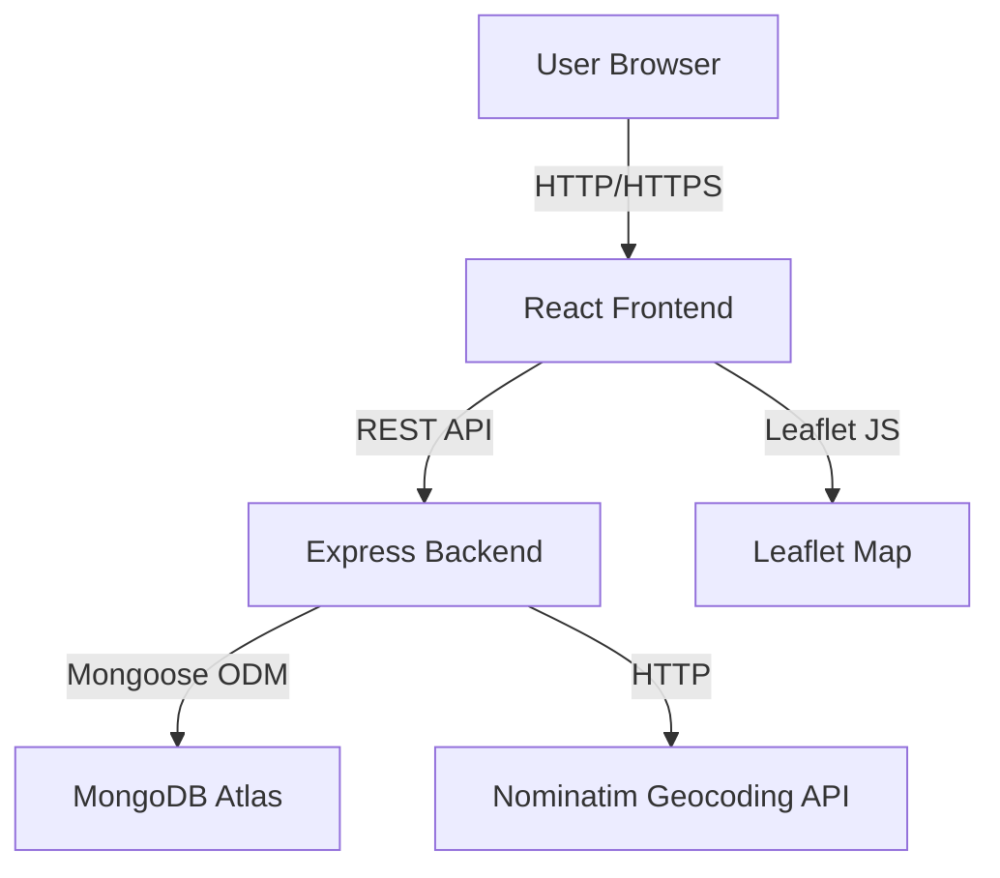
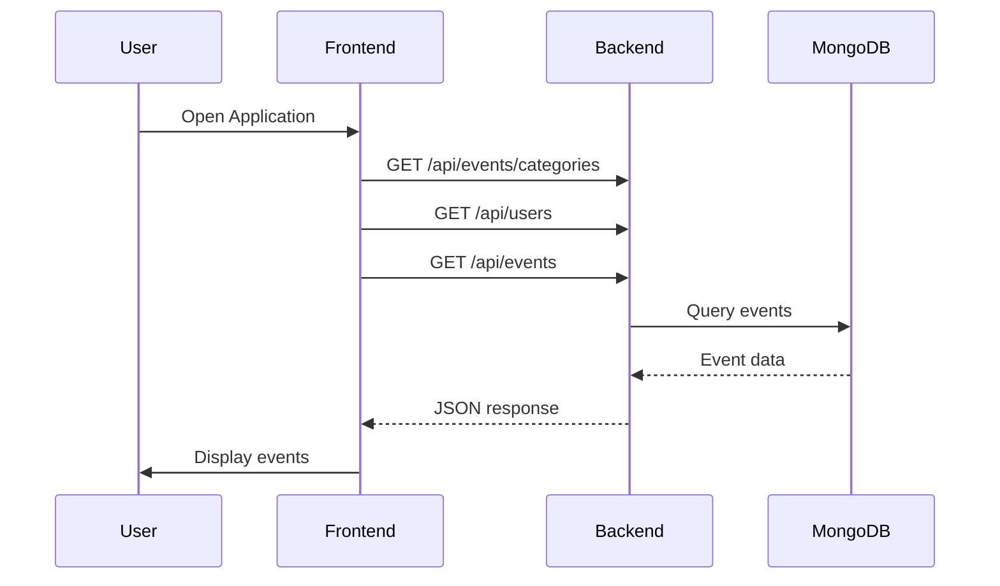
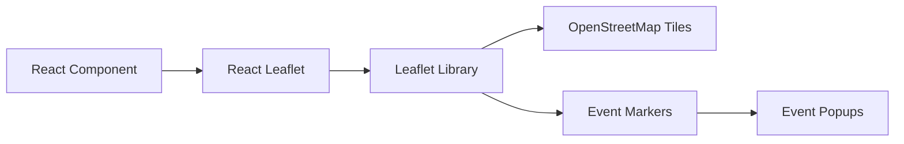
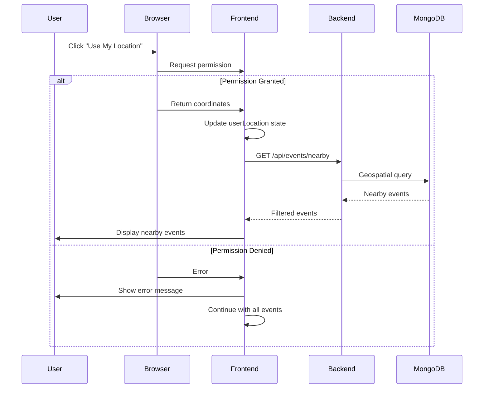
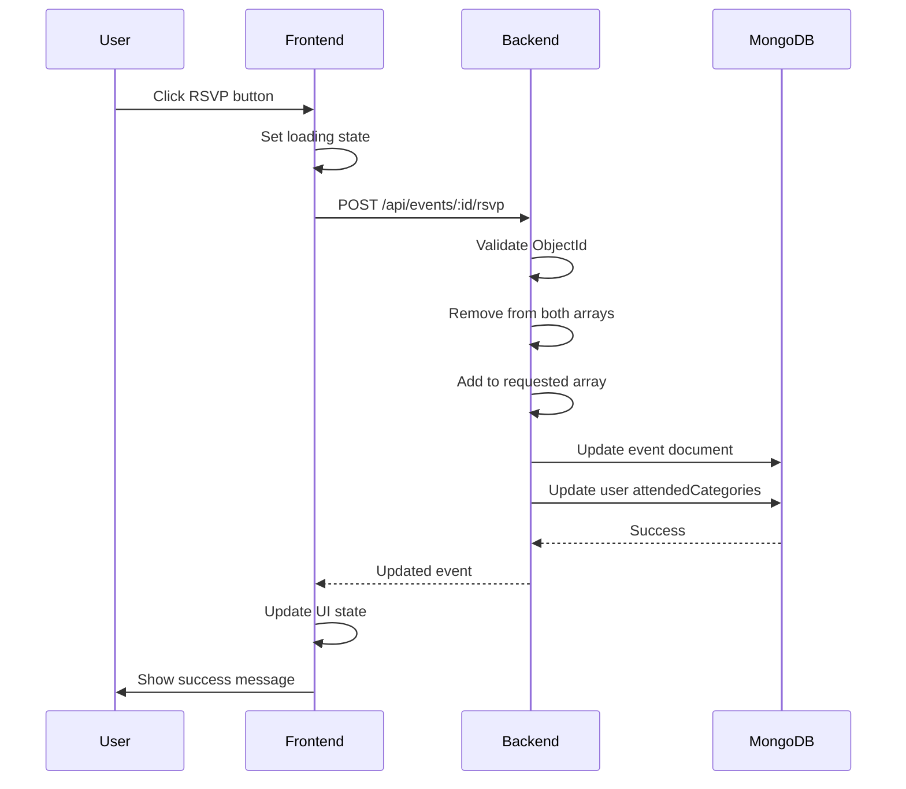
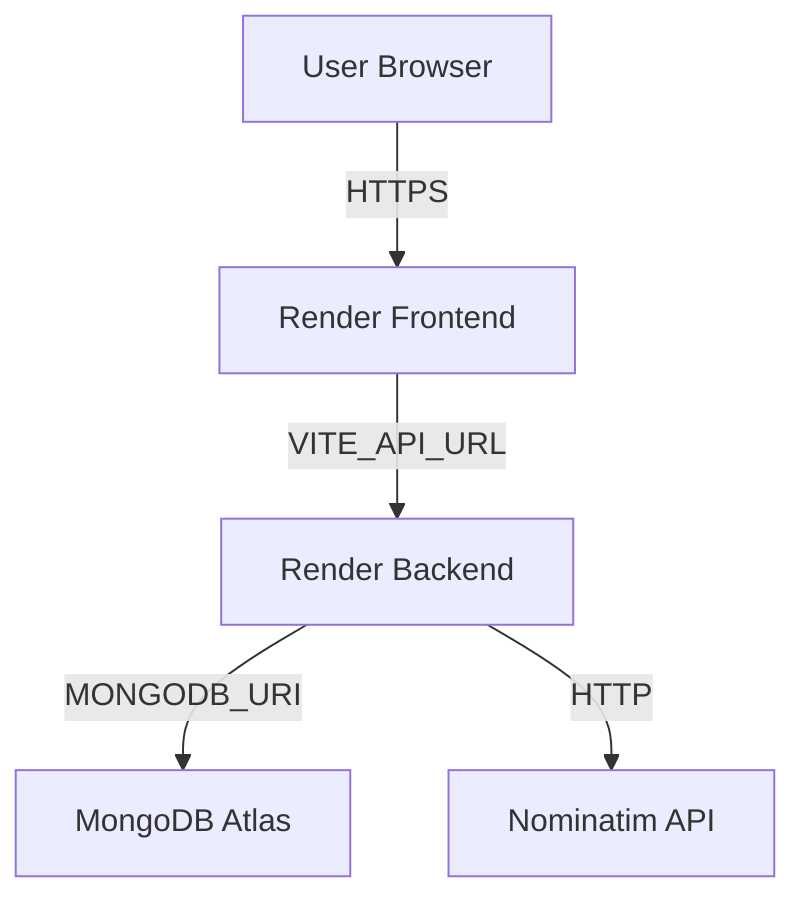

# LocalVibe Architecture Documentation

## Overall Architecture

LocalVibe is a full-stack web application that enables users to discover, create, and interact with local events using geospatial functionality. The application follows a classic three-tier architecture:



## Technology Stack

### Frontend
- **React 18.3** - UI library for building interactive user interfaces
- **Vite 5.4** - Build tool and development server
- **Leaflet 1.9** - Open-source JavaScript library for interactive maps
- **React Leaflet 4.2** - React integration for Leaflet
- **JavaScript (ES6+)** - Programming language

### Backend
- **Node.js** - JavaScript runtime
- **Express 4.21** - Web application framework
- **Mongoose 9.0** - MongoDB object modeling and validation
- **CORS 2.8** - Cross-origin resource sharing middleware
- **dotenv 16.4** - Environment variable management

### Database
- **MongoDB Atlas** - Cloud-hosted MongoDB database
- **2dsphere Index** - Geospatial indexing for location-based queries

### External Services
- **OpenStreetMap Nominatim** - Geocoding and address autocomplete
- **OpenStreetMap Tiles** - Map tile rendering

## Frontend Architecture

### Component Structure

```
frontend/src/
├── main.jsx                 # Application entry point
├── App.jsx                 # Main application component
├── components/
│   ├── EventList.jsx       # Event listing with cards
│   ├── EventMap.jsx        # Interactive map with markers
│   ├── EventForm.jsx       # Event creation/editing form
│   ├── Filters.jsx         # Filter controls
│   └── UserProfile.jsx     # User profile and RSVP information
├── services/
│   └── api.js              # API service layer
└── styles/
    └── index.css           # Global styles
```

### State Management

LocalVibe uses React's built-in state management with hooks:

- **useState** - Component-level state
- **useEffect** - Side effects and data fetching
- **useCallback** - Memoized callback functions
- **useMemo** - Memoized values for performance

### API Communication

The frontend communicates with the backend through a centralized API service (`api.js`):

```javascript
const API_BASE = import.meta.env.VITE_API_URL || '/api';
```

Environment-based configuration:
- **Development:** `http://localhost:5000/api`
- **Production:** `https://localvibe-backend-2026.onrender.com/api`

### User Flow



## Backend Architecture

### Project Structure

```
backend/
├── server.js               # Express server setup
├── config/
│   └── db.js              # MongoDB connection configuration
├── models/
│   ├── Event.js           # Event schema and model
│   └── User.js            # User schema and model
├── routes/
│   ├── events.js          # Event CRUD and filtering
│   ├── rsvp.js            # RSVP operations
│   ├── users.js           # User operations
│   └── geocode.js         # Geocoding proxy
└── scripts/
    └── seed.js            # Database seeding
```

### Express Middleware Stack

1. **CORS** - Cross-origin resource sharing with origin validation
2. **express.json()** - JSON request body parsing
3. **Security Headers** - X-Content-Type-Options, X-Frame-Options, X-XSS-Protection, HSTS
4. **Route Handlers** - API endpoint logic
5. **Error Handler** - Global error handling middleware

### API Endpoints

**Health:**
- `GET /api/health` - Service health check

**Events:**
- `GET /api/events` - List events with filters
- `GET /api/events/categories` - Get available categories
- `GET /api/events/nearby` - Geospatial nearby search
- `GET /api/events/:id` - Get single event
- `POST /api/events` - Create event
- `PUT /api/events/:id` - Update event
- `DELETE /api/events/:id` - Delete event

**RSVP:**
- `POST /api/events/:id/rsvp` - RSVP to event

**Users:**
- `GET /api/users` - List users
- `GET /api/users/:id` - Get user
- `GET /api/users/:id/events` - Get user's events
- `POST /api/users/:id/follow/:targetId` - Follow user

**Geocoding:**
- `GET /api/geocode?q=` - Address geocoding

**Recommendations:**
- `GET /api/events/recommendations/:userId` - Get recommendations

## Database Architecture

### MongoDB Schema Design

#### Event Schema

```javascript
{
  title: String (required)
  description: String
  startDate: Date (required)
  endDate: Date (required)
  location: {
    address: String (required)
    coordinates: {
      type: "Point"
      coordinates: [Number, Number] // [longitude, latitude]
    }
  }
  category: Enum (Music, Food, Arts, Sports, Community, Nightlife, Markets, Technology, Other)
  price: Number (default: 0, min: 0)
  image: String
  organizer: ObjectId (ref: User)
  isFeatured: Boolean (default: false)
  going: [ObjectId] (ref: User)
  interested: [ObjectId] (ref: User)
}
```

#### User Schema

```javascript
{
  name: String (required)
  email: String (required, unique)
  avatar: String
  following: [ObjectId] (ref: User)
  attendedCategories: [String]
}
```

### Geospatial Indexing

Events use MongoDB's 2dsphere index for efficient geospatial queries:

```javascript
eventSchema.index({ 'location.coordinates': '2dsphere' });
```

This enables:
- `$near` queries for nearby events
- Distance calculations
- Radius-based filtering

### Indexes

- **Primary:** `_id` (automatic)
- **Geospatial:** `location.coordinates` (2dsphere)
- **Composite:** `startDate + category` for efficient date+category queries

## Geospatial Architecture

### Coordinate System

LocalVibe uses **GeoJSON** coordinate format:
- **Storage:** `[longitude, latitude]` (GeoJSON standard)
- **Display:** `[latitude, longitude]` (Leaflet standard)

### Nearby Search Algorithm

```javascript
{
  'location.coordinates': {
    $near: {
      $geometry: {
        type: 'Point',
        coordinates: [lng, lat]
      },
      $maxDistance: radiusKm * 1000 // Convert to meters
    }
  }
}
```

### Distance Calculation

Haversine formula for great-circle distance between two points on Earth:

```javascript
const radiusEarthKm = 6371;
const dLat = ((lat2 - lat1) * Math.PI) / 180;
const dLng = ((lng2 - lng1) * Math.PI) / 180;
const a = Math.sin(dLat / 2) * Math.sin(dLat / 2) +
         Math.cos((lat1 * Math.PI) / 180) *
         Math.cos((lat2 * Math.PI) / 180) *
         Math.sin(dLng / 2) * Math.sin(dLng / 2);
const distance = 2 * radiusEarthKm * Math.atan2(Math.sqrt(a), Math.sqrt(1 - a));
```

## Map Integration Architecture

### Leaflet Integration



### Marker System

- **Default Markers:** Blue pins for regular events
- **Featured Markers:** Gold pins for featured events
- **User Location:** Cyan circle with white border

### Geolocation Flow



## RSVP System Architecture

### RSVP Flow



### Duplicate Prevention

The backend prevents duplicate RSVPs by:
1. Removing user from both `going` and `interested` arrays
2. Adding user to the requested array
3. Using atomic MongoDB operations

## Security Architecture

### CORS Configuration

```javascript
const getAllowedOrigins = () => {
  const origins = [process.env.FRONTEND_URL].filter(Boolean);
  if (isDevelopment) {
    origins.push(
      'http://localhost:5173',
      'http://localhost:5174',
      'http://127.0.0.1:5173',
      'http://127.0.0.1:5174'
    );
  }
  return origins;
};
```

### Security Headers

- **X-Content-Type-Options: nosniff** - Prevent MIME type sniffing
- **X-Frame-Options: DENY** - Prevent clickjacking
- **X-XSS-Protection: 1; mode=block** - XSS protection
- **Strict-Transport-Security** - Enforce HTTPS (production)

### Input Validation

- **ObjectId validation** - Prevent invalid MongoDB IDs
- **Category normalization** - Case-insensitive category matching
- **Coordinate validation** - Latitude (-90 to 90), Longitude (-180 to 180)
- **Date validation** - End date must be after start date
- **Radius validation** - Must be positive number

### Error Handling

- Generic error messages for internal errors
- No stack traces exposed to clients
- Specific validation errors for bad requests
- Graceful degradation for external service failures

## Deployment Architecture

### Production Deployment



### Environment Configuration

**Backend Environment Variables:**
- `PORT` - Server port (default: 5000)
- `MONGODB_URI` - MongoDB connection string
- `NODE_ENV` - Environment (development/production)
- `FRONTEND_URL` - Frontend URL for CORS

**Frontend Environment Variables:**
- `VITE_API_URL` - Backend API base URL

### Render Deployment

**Frontend:**
- Build: `npm run build`
- Output: `dist/` directory
- Start: `npm run preview`

**Backend:**
- Build: `npm install`
- Start: `npm start`

## Data Flow Summary

1. **Event Discovery:** Frontend → Backend → MongoDB → Backend → Frontend
2. **Event Creation:** Frontend → Backend → MongoDB → Backend → Frontend
3. **RSVP:** Frontend → Backend → MongoDB (update event + user) → Backend → Frontend
4. **Geolocation:** Browser → Frontend → Backend → MongoDB (geospatial query) → Backend → Frontend
5. **Geocoding:** Frontend → Backend → Nominatim → Backend → Frontend

## Scalability Considerations

### Current Implementation
- MongoDB Atlas provides horizontal scaling
- Render auto-scales based on traffic
- Stateless backend design supports horizontal scaling
- Geospatial queries are optimized with 2dsphere index

### Future Enhancements
- Redis caching for frequently accessed events
- CDN for static assets and map tiles
- Database read replicas for high traffic
- API rate limiting
- WebSocket support for real-time updates
