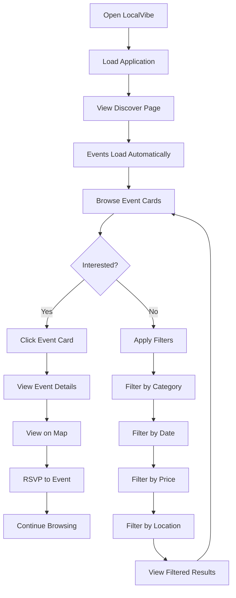
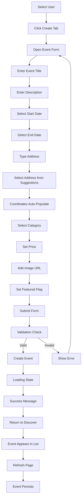
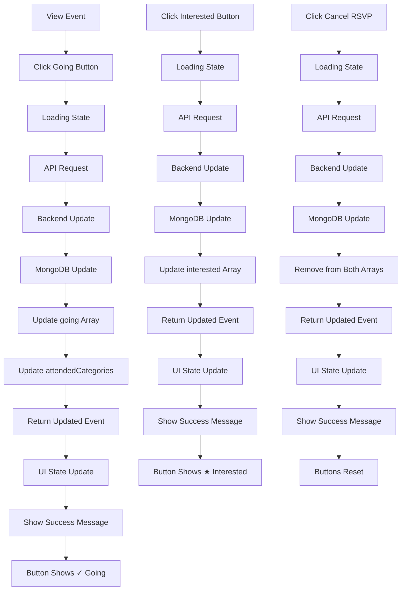
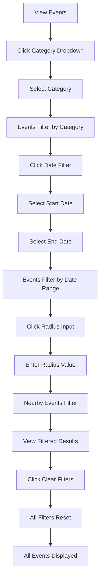
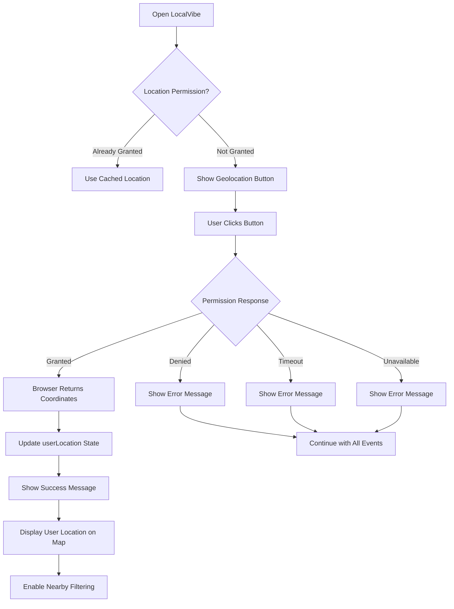
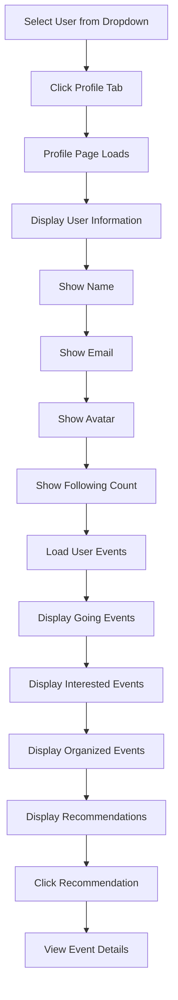
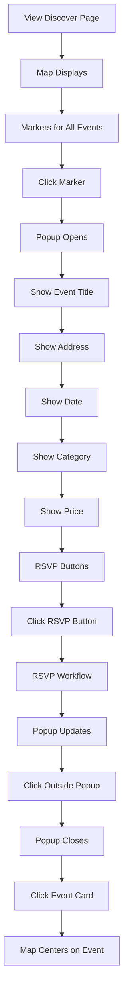
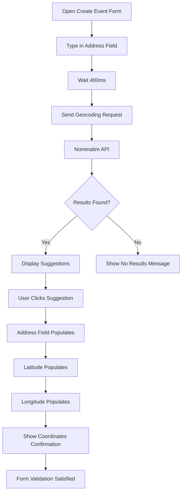
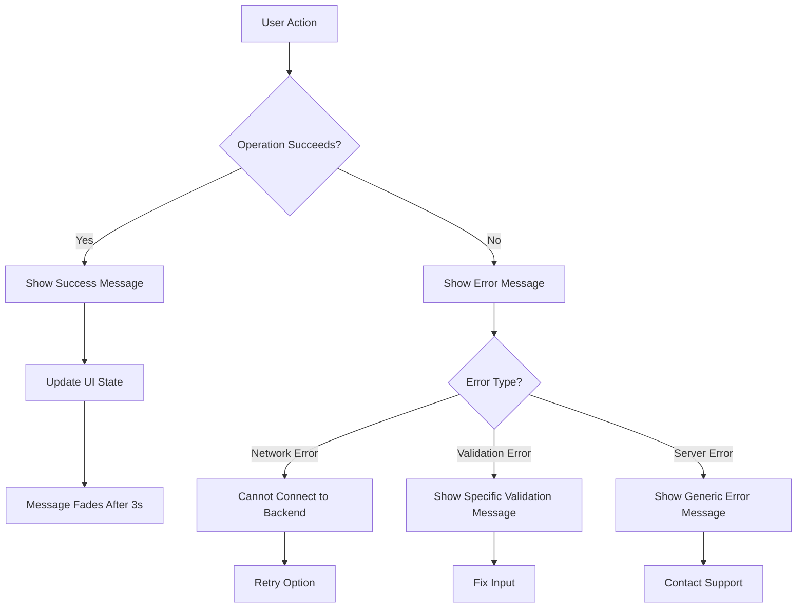
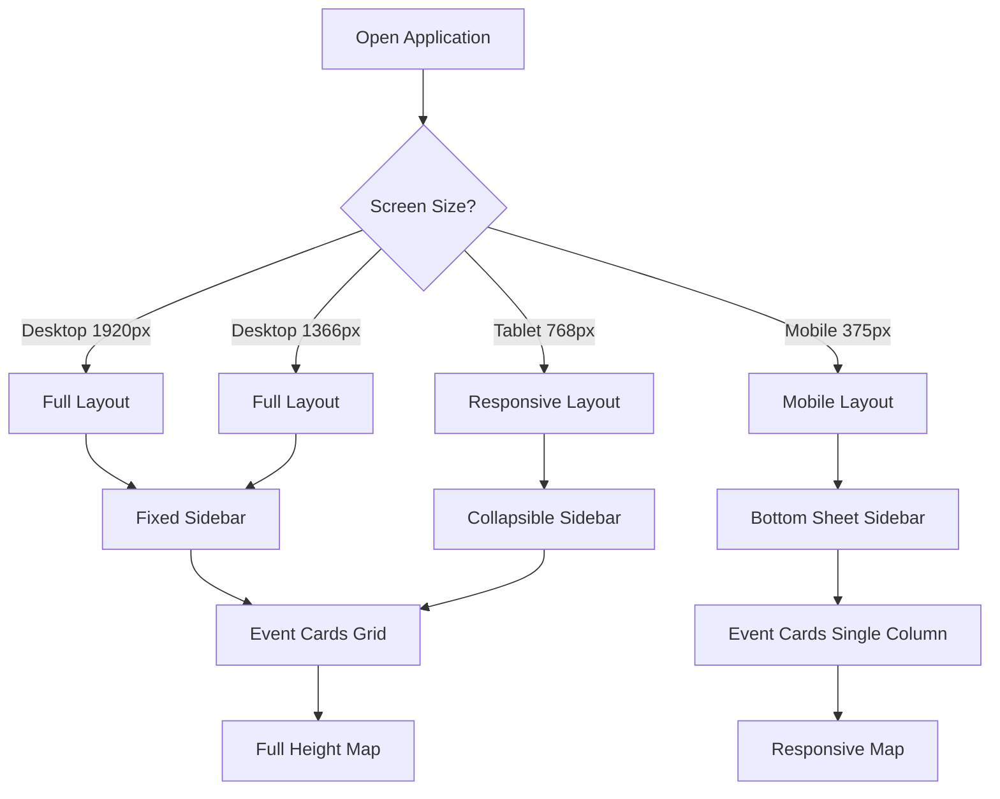

# LocalVibe User Workflow Documentation

## Overview

This document describes the typical user workflows and journeys through the LocalVibe application.

## Primary User Workflows

### 1. Event Discovery Workflow

**Steps:**
1. User opens LocalVibe application
2. Application loads and displays Discover page
3. Events automatically load from backend
4. User browses event cards showing title, category, date, location
5. User can click an event to view details
6. User can apply filters to narrow results
7. User can RSVP to events of interest

### 2. Event Creation Workflow

**Steps:**
1. User selects a user profile from dropdown
2. User clicks "Create" tab
3. Event form opens with all fields
4. User enters event title (required)
5. User enters event description (optional)
6. User selects start date and time (required)
7. User selects end date and time (required)
8. User types address for location
9. System provides address suggestions via Nominatim
10. User selects address from suggestions
11. Coordinates automatically populate from selection
12. User selects category from dropdown (required)
13. User sets price (default: 0 for free)
14. User optionally adds image URL
15. User optionally marks as featured
16. User submits form
17. System validates all required fields
18. If valid, event is created and stored in MongoDB
19. Success message displays
20. User returns to Discover page
21. New event appears immediately in list
22. Event persists after page refresh

### 3. RSVP Workflow

**Steps:**

**Going RSVP:**
1. User views event details
2. User clicks "Going" button
3. Button shows loading state ("...")
4. API request sent to backend
5. Backend removes user from both going and interested arrays
6. Backend adds user to going array
7. Backend updates user's attendedCategories with event category
8. MongoDB updates event and user documents
9. Updated event returned to frontend
10. Frontend updates UI state immediately
11. Success message displays: "RSVP confirmed: You are going!"
12. Button shows "✓ Going"

**Interested RSVP:**
1. User views event details
2. User clicks "Interested" button
3. Button shows loading state ("...")
4. API request sent to backend
5. Backend removes user from both going and interested arrays
6. Backend adds user to interested array
7. MongoDB updates event document
8. Updated event returned to frontend
9. Frontend updates UI state immediately
10. Success message displays: "RSVP confirmed: You are interested!"
11. Button shows "★ Interested"

**Cancel RSVP:**
1. User views event details
2. User clicks cancel button (Going or Interested)
3. Button shows loading state ("...")
4. API request sent to backend with status "none"
5. Backend removes user from both going and interested arrays
6. MongoDB updates event document
7. Updated event returned to frontend
8. Frontend updates UI state immediately
9. Success message displays: "RSVP removed."
10. Buttons reset to unselected state

### 4. Filtering Workflow

**Steps:**
1. User views events on Discover page
2. User clicks category dropdown
3. User selects a category (e.g., Technology)
4. Events automatically filter to show only that category
5. User can select start date
6. Events filter to show events on or after that date
7. User can select end date
8. Events filter to show events on or before that date
9. User can enter radius value
10. Events filter to show events within that radius of user's location
11. User can clear all filters with one click
12. All events are displayed again

### 5. Geolocation Workflow

**Steps:**
1. User opens LocalVibe
2. Application checks for location permission
3. If already granted, uses cached location
4. If not granted, shows geolocation button
5. User clicks "Use My Location" button
6. Browser requests location permission
7. **If granted:**
   - Browser returns coordinates
   - Application updates userLocation state
   - Success message displays: "Your location was detected."
   - User location marker appears on map
   - Nearby filtering becomes available
8. **If denied:**
   - Error message displays: "Could not access your location. Events will still be displayed."
   - Application continues with all events
9. **If timeout:**
   - Error message displays
   - Application continues with all events
10. **If unavailable:**
    - Error message displays
    - Application continues with all events

### 6. User Profile Workflow

**Steps:**
1. User selects a user from the dropdown in header
2. User clicks "Profile" tab
3. Profile page loads
4. User information displays:
   - Name
   - Email
   - Avatar
   - Following count
5. User's events load from backend:
   - Events user is going to
   - Events user is interested in
   - Events user organized
6. Recommendations display based on attended categories
7. User can click any event to view details

### 7. Map Interaction Workflow

**Steps:**
1. User views Discover page
2. Map displays with markers for all events
3. Regular events: Blue markers
4. Featured events: Gold markers
5. User location: Cyan circle (if geolocation enabled)
6. User clicks a marker
7. Popup opens with event information:
   - Title
   - Address
   - Date/time
   - Category badge
   - Price
   - RSVP buttons (if user selected)
8. User can RSVP directly from popup
9. Popup updates to reflect RSVP status
10. User clicks outside popup to close
11. User clicks an event card
12. Map automatically centers on that event
13. Map zooms in for better view

### 8. Address Selection Workflow

**Steps:**
1. User opens create event form
2. User starts typing in address field
3. After 400ms debounce, geocoding request sent
4. Backend proxies request to Nominatim API
5. **If results found:**
   - Suggestions display in dropdown
   - Each suggestion shows full address
   - User clicks a suggestion
   - Address field populates with selected address
   - Latitude and longitude fields auto-populate
   - Confirmation message shows coordinates
6. **If no results:**
   - "No matching locations found" message displays
7. Form validation requires coordinates before submission

### 9. Error Handling Workflow

**Error Types:**

**Network Error:**
- Message: "Cannot connect to backend server. Check that the server is running and configured correctly."
- Cause: Backend not running or unreachable
- Action: Check backend status, network connection

**Validation Error:**
- Message: Specific to validation failure (e.g., "End date must be after start date")
- Cause: Invalid user input
- Action: Fix input and retry

**Server Error:**
- Message: "Internal server error"
- Cause: Backend error or database issue
- Action: Contact support or try again later

### 10. Responsive Design Workflow

**Desktop (> 1024px):**
- Fixed sidebar on left
- Event cards in grid layout
- Full-height map
- All filters visible

**Tablet (768px - 1024px):**
- Collapsible sidebar
- Event cards in 2-column grid
- Responsive map sizing
- Touch-friendly buttons

**Mobile (< 768px):**
- Bottom sheet or collapsible sidebar
- Event cards in single column
- Responsive map sizing
- Full-width form inputs
- Minimum 44px touch targets
- No horizontal scroll

## User Personas

### Event Seeker

**Goals:**
- Find events happening nearby
- Discover events by category
- See what friends are attending
- RSVP to events of interest

**Primary Workflow:**
1. Open LocalVibe
2. Use geolocation to find nearby events
3. Filter by category (e.g., Music)
4. Browse event cards
5. View event details on map
6. RSVP to interesting events
7. Check profile for upcoming events

### Event Organizer

**Goals:**
- Create new events
- Manage event details
- Track RSVPs
- Promote featured events

**Primary Workflow:**
1. Select user profile
2. Click Create tab
3. Fill event form with details
4. Select address from suggestions
5. Set category and price
6. Mark as featured if desired
7. Submit event
8. Monitor RSVPs in profile

### Social User

**Goals:**
- See what friends are attending
- Follow other users
- Get personalized recommendations
- Discover trending events

**Primary Workflow:**
1. Select user profile
2. View following list
3. Check "friends going" information
4. Browse recommendations
5. RSVP to events friends are attending

## Edge Cases

### No Events Found

**Scenario:** User applies filters that return no results

**Workflow:**
1. Filter applied
2. No events match criteria
3. Empty state message displays: "No events found nearby. Try increasing the radius or clearing filters."
4. Clear filters button available
5. User can adjust filters or clear all

### Geolocation Denied

**Scenario:** User denies location permission

**Workflow:**
1. User clicks geolocation button
2. Browser shows permission prompt
3. User denies permission
4. Error message displays: "Could not access your location. Events will still be displayed."
5. Application continues with all events
6. Nearby filtering not available

### Network Failure

**Scenario:** Backend becomes unreachable

**Workflow:**
1. User performs action (e.g., load events)
2. Request fails
3. Error message displays: "Cannot connect to backend server. Check that the server is running and configured correctly."
4. Loading state clears
5. Previous data may still be displayed
6. User can retry action

### Image Load Failure

**Scenario:** Event image URL is broken

**Workflow:**
1. Event card tries to load image
2. Image fails to load
3. onError handler triggered
4. Image replaced with fallback SVG
5. Fallback displays consistently
6. No broken image icon visible

### Address Autocomplete Failure

**Scenario:** Nominatim API returns no results

**Workflow:**
1. User types address
2. Geocoding request sent
3. Nominatim returns empty results
4. "No matching locations found" message displays
5. User can try different address
6. Form validation requires address selection

## Performance Considerations

### Initial Load

- Categories and users load on application start
- Events load automatically on Discover page
- Loading states shown during data fetch
- Error states displayed if fetch fails

### Filter Application

- Filters trigger immediate API request
- Debouncing for search input (not currently implemented)
- Loading state during filter application
- Results update immediately

### Map Rendering

- Leaflet renders markers for all events
- Large event counts may impact performance
- Consider pagination for 100+ events

### RSVP Operations

- Immediate UI state update for responsiveness
- Background API request
- Success/error feedback after completion
- Loading state prevents duplicate clicks

## Accessibility Considerations

### Keyboard Navigation

- Tab navigation through controls
- Enter/Space for button activation
- Escape to close modals/popups

### Screen Reader Support

- Semantic HTML structure
- ARIA labels where needed
- Alt text for images
- Focus management

### Color Contrast

- WCAG AA compliant color ratios
- High contrast for text
- Clear visual hierarchy

### Touch Targets

- Minimum 44px height for buttons
- Adequate spacing between controls
- Large tap areas on mobile

## Conclusion

The LocalVibe user workflows are designed to be intuitive and efficient, with clear feedback at each step. Error handling is graceful, and the application degrades gracefully when external services are unavailable. The responsive design ensures a consistent experience across devices.
